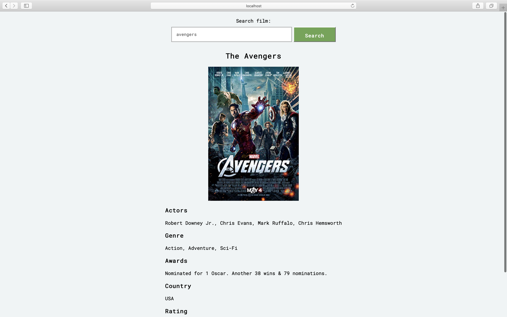

# Search films app 🎬

It's demo application on this stack.

## Stack 🗄

- ReactJS (JS library with virtualDOM)
- TypeScript (Strong typing and the future of JavaScript
- Parcel (zero-configuration bundler)
- Storeon (state manager)

## How to up and run 🔨

1. You need to get api key on [http://www.omdbapi.com]

2. After create file .env on root your project and add API_KEY=[your key]

3. Install dependencies:

```
yarn
```

4. Start dev:

```
yarn start
```

## Screen 📺


